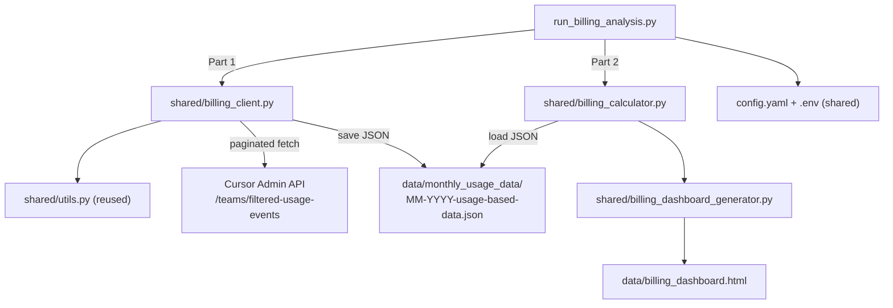

# On-Demand Billing Analysis Script

## Overview

Build a two-part `run_billing_analysis.py` script under `ai_adoption/`. Part 1 fetches on-demand usage data from the Cursor Admin API and caches it as monthly JSON files. Part 2 loads the cached JSON, aggregates costs by month/model/user, and generates an HTML billing dashboard.

## Implementation Tasks

1. Add `billing:` section to `config.yaml` with months_back, page_size, output_filename settings
2. Create `shared/billing_client.py` with paginated `/teams/filtered-usage-events` fetching, rate-limit throttle, exponential backoff, and JSON caching
3. Create `shared/billing_calculator.py` to load cached JSON and aggregate events by month, model, and user into structured metrics
4. Create `shared/billing_dashboard_generator.py` to render HTML billing dashboard with trend, model breakdown, and top spenders
5. Create `run_billing_analysis.py` entry point that orchestrates Part 1 (fetch+cache) then Part 2 (analyze+dashboard)

---

## API Endpoint

**`POST /teams/filtered-usage-events`** (Admin API) -- the only endpoint with per-event cost data + model + user attribution.

Each event returns: `userEmail`, `model`, `kind` (`"Usage-based"` / `"Included in Business"`), `tokenUsage.totalCents`, `cursorTokenFee`, `isChargeable`, `isTokenBasedCall`, token breakdown.

**Cost formula** (to match Cursor Dashboard): `tokenUsage.totalCents + cursorTokenFee`

**Filter criteria**: `kind == "Usage-based"` AND `isChargeable == true` AND `isTokenBasedCall == true`

### Constraints

- **30-day max** date range per request -- one request window per calendar month
- **Rate limit**: 20 req/min -- throttle with 3s delay between requests + exponential backoff on 429
- **Pagination**: default `pageSize` is 10 -- use higher value (e.g. 100), loop until `hasNextPage == false`
- Existing `CURSOR_API_KEY` in `.env` is an Admin API key -- works for this endpoint

---

## Two-Part Script Design

### Part 1: Fetch & Cache (API -> JSON)

For each month in the configured range:

1. Check if `data/monthly_usage_data/MM-YYYY-usage-based-data.json` already exists
2. If exists -> **skip** (no API calls)
3. If missing -> fetch from API with pagination, save to JSON

**Config-driven range**: `billing.months_back: 2` (start with Jan+Feb 2026, later increase to 6 or 9)

**Rate limit handling**:

- 3-second delay between paginated requests (keeps us under 20 req/min)
- Exponential backoff on HTTP 429 responses (1s, 2s, 4s, 8s, 16s, max 5 retries)
- Progress logging: "Fetching page 3/12 for January 2026..."

**JSON cache file format** (`01-2026-usage-based-data.json`):

```json
{
  "month": "01-2026",
  "fetched_at": "2026-02-24T16:30:00Z",
  "total_events": 1523,
  "events": [
    {
      "timestamp": "1750979225854",
      "userEmail": "dev@company.com",
      "model": "claude-4.6-opus-high-thinking",
      "kind": "Usage-based",
      "maxMode": true,
      "isChargeable": true,
      "isTokenBasedCall": true,
      "tokenUsage": {
        "inputTokens": 126,
        "outputTokens": 450,
        "cacheWriteTokens": 6112,
        "cacheReadTokens": 11964,
        "totalCents": 20.18
      },
      "cursorTokenFee": 1.18
    }
  ]
}
```

### Part 2: Analyze & Dashboard (JSON -> HTML)

Loads all `*-usage-based-data.json` files from `data/monthly_usage_data/`, aggregates, and generates dashboard at `data/billing_dashboard.html`.

---

## Architecture



---

## New Files

### 1. `ai_adoption/run_billing_analysis.py` -- Entry Point

- Loads shared config + `.env` via `shared/utils.py`
- **Part 1**: Computes month list from `billing.months_back`, checks cache, fetches missing months
- **Part 2**: Loads all cached JSON, passes to calculator, generates dashboard
- Clear console output with step progress

### 2. `ai_adoption/shared/billing_client.py` -- API Client + Cache

- `fetch_monthly_usage_events(year, month)` -- fetches all usage-based events for one month with pagination
- `get_cached_months(data_dir)` -- lists already-cached month files
- `save_month_cache(data_dir, year, month, events)` -- writes JSON cache file
- `load_month_cache(filepath)` -- reads JSON cache file
- 3s throttle between pages, exponential backoff on 429
- Only collects events where `kind == "Usage-based"` AND `isChargeable == true`

### 3. `ai_adoption/shared/billing_calculator.py` -- Aggregation Logic

Loads all cached JSON files from `data/monthly_usage_data/` and computes the following analytics:

**Priority 1 -- Top Cost Users (which users created the most cost):**

- Cumulative on-demand spend per user across all months, ranked highest to lowest
- Per-month spend per user (trend: is a user's spend increasing?)
- Each user's most-used model and their average cost per request

**Priority 2 -- Users x Expensive Models (which users use the costliest models):**

- For each expensive model (e.g. `claude-4.6-opus-high-thinking`), list users ranked by spend on that model
- Cross-reference: which users consistently pick the costliest models vs cheaper alternatives

**Priority 3 -- Top Cost Models (which models cost the most overall):**

- Cumulative on-demand spend per model across all months, ranked highest to lowest
- Per-month spend per model (trend: is a model's cost growing?)
- Per model: total tokens, total requests, avg cost per request, unique user count

**Supporting analytics:**

- Monthly billing trend: total on-demand cost per month with month-over-month delta
- Monthly cost matrix: month x model x cost (replicates the Cursor Dashboard screenshot)
- Monthly user cost: month x user x cost x top model used

### 4. `ai_adoption/shared/billing_dashboard_generator.py` -- HTML Dashboard

Self-contained HTML with embedded CSS (same pattern as existing `dashboard_generator.py`). Output: `data/billing_dashboard.html`

- **Summary cards**: total on-demand spend, current month spend, months analyzed, costliest model, top spender
- **Top Cost Users**: ranked table -- user, cumulative spend, top model, avg cost/request (Priority 1)
- **Users x Expensive Models**: for each top model, which users drove the cost (Priority 2)
- **Top Cost Models**: ranked table -- model, cumulative spend, requests, tokens, unique users (Priority 3)
- **Monthly Billing Trend**: month-over-month total cost with delta/growth percentage
- **Monthly Model Breakdown**: per-month table matching the Cursor Dashboard screenshot layout (model, tokens, requests, total cost)
- **Monthly User Breakdown**: per-month top spenders with their top model

### 5. Update `ai_adoption/config.yaml`

```yaml
billing:
  months_back: 2              # how many months back to analyze (start with 2 = Jan+Feb 2026)
  page_size: 100              # events per API page
  output_filename: "billing_dashboard.html"
  top_spenders_count: 20
  request_delay_seconds: 3    # delay between API calls to respect rate limit
```

---

## Initial Scope (First Iteration)

- `months_back: 2` -- only January 2026 and February 2026
- Validate the data fetched matches expectations
- Once confirmed, increase `months_back` to 6 (back to Sep 2025) -- cached months won't be re-fetched

---

## API Documentation References

- [Cursor APIs Overview](https://cursor.com/docs/api)
- [Admin API - filtered-usage-events](https://cursor.com/docs/account/teams/admin-api)
- [Analytics API](https://cursor.com/docs/account/teams/analytics-api)
